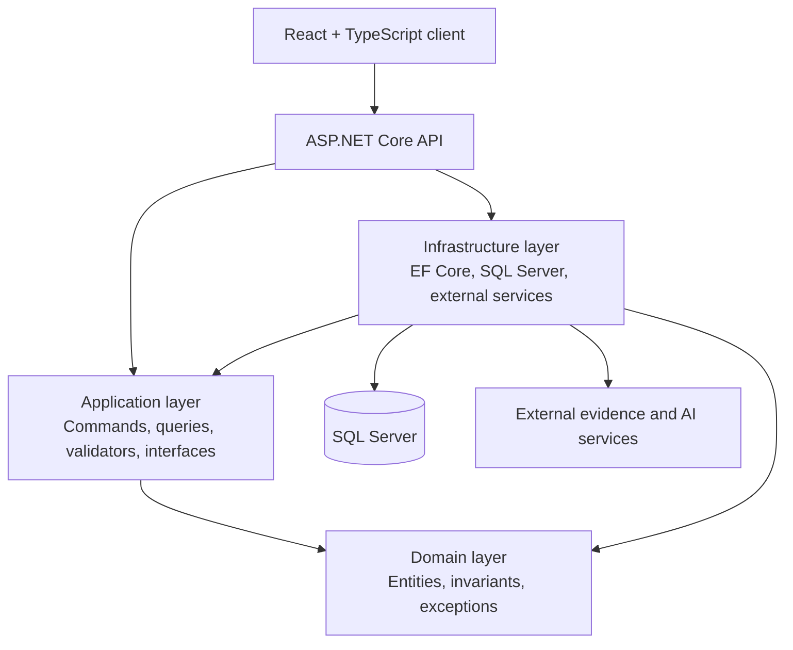
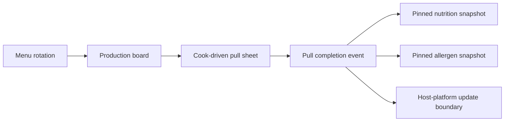

# Architecture

Grocery is built as an enterprise food-service operations platform using .NET
Clean Architecture with a React operator interface.

## Layering

The important rule is dependency direction: domain logic does not know about
controllers, persistence, cloud services, or UI concerns.

## Primary Workflow

Grocery treats production as an execution event, not just a status toggle. The
pull completion captures what was actually pulled and produced, including
substitutions and member splits for grouped ingredients.

## Clean Architecture Responsibilities

| Layer | Responsibility |
| --- | --- |
| Domain | Entities, invariant-friendly models, domain exceptions |
| Application | Command/query contracts, validation, orchestration interfaces |
| Infrastructure | EF Core persistence, external service clients, SQL Server wiring |
| API | Thin HTTP endpoints, auth/middleware, dependency composition |
| Client | Operator surfaces built around the job being done |

## Domain Model Highlights

Grocery separates concepts that legacy systems often flatten:

- **Item**: physical stock row, often vendor-scoped.
- **ItemGroup**: cross-vendor identity for the same logical ingredient.
- **Recipe**: authored production definition with ingredients, yield, and steps.
- **PullCompletion**: authoritative event for what was actually produced.
- **ProductionRunNutrition / ProductionRunAllergen**: pinned facts for a specific
  production event.

This separation matters because vendor identity, recipe authorship, kitchen
execution, and host-platform menu identity are not the same problem.

## Integration Posture

The production product includes a private integration boundary with an existing
enterprise food-service platform. This proof repo intentionally describes that
boundary at the architectural level only:

- local system owns the operator workflow and production event truth
- host platform remains the downstream consumer for selected fields
- failed external pushes do not corrupt local saves
- source precedence prevents lower-authority data from overwriting authored data

## Why This Is Not Generic CRUD

Grocery's value is in the operational rules:

- Pull sheets are cook-driven, not automatically authoritative.
- Allergens union and never silently subtract.
- Nutrition is estimated on recipes but authoritative at production completion.
- Vendor item variance is real and must be surfaced instead of hidden.
- Physical storage order matters because cooks walk a real kitchen.

Those rules are the product.
